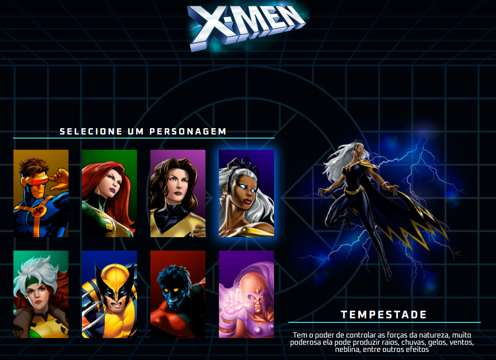

# X-Men project

This is a project to the [X-Men project page](https://rafaelsanm.github.io/x-men-project/).  

As most of my work, this solution is being constantly updated as I learn new things and find better solutions for my problems, so please, take this into consideration!

### Screenshots

### Built with

- Semantic HTML5 markup
- CSS custom properties
- Flexbox
- JavaScript
